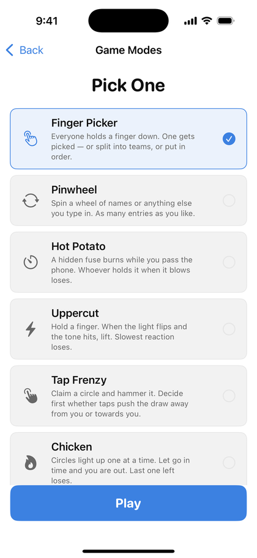
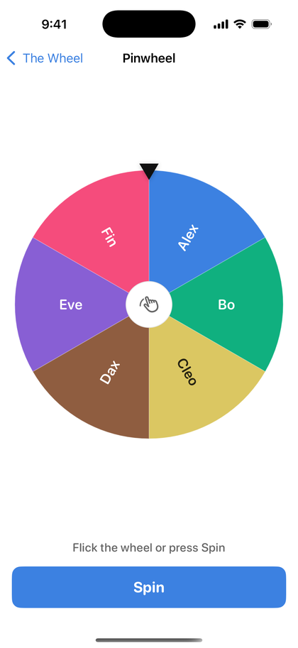
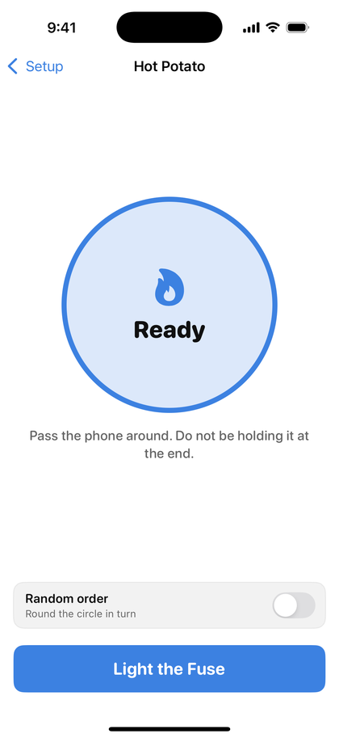
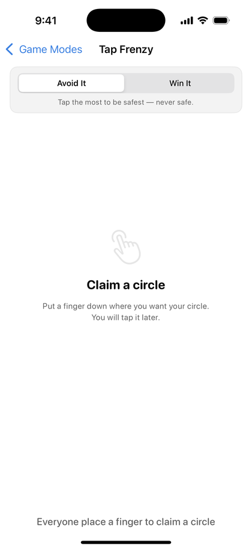
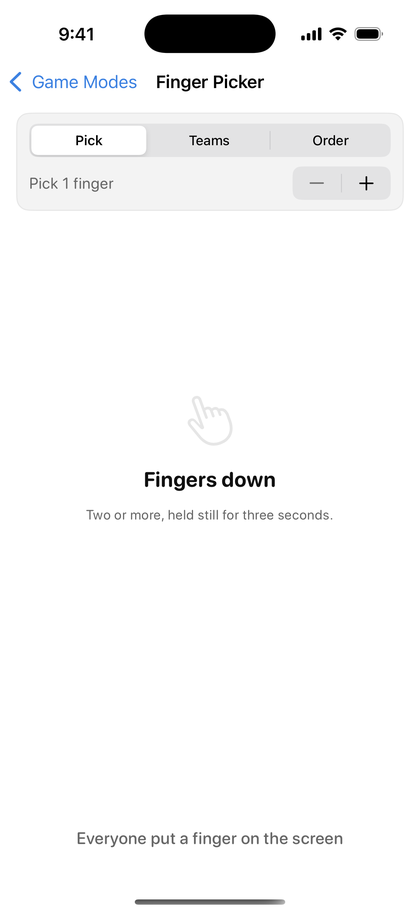
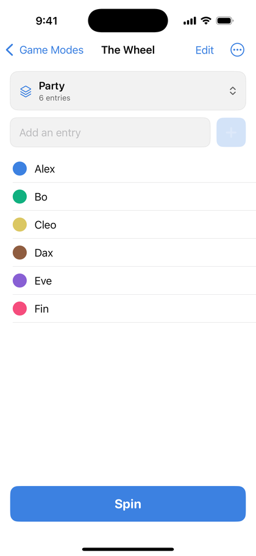
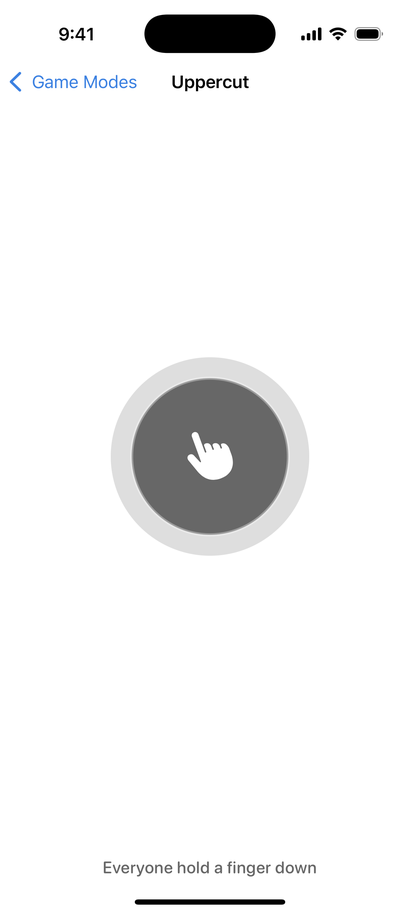
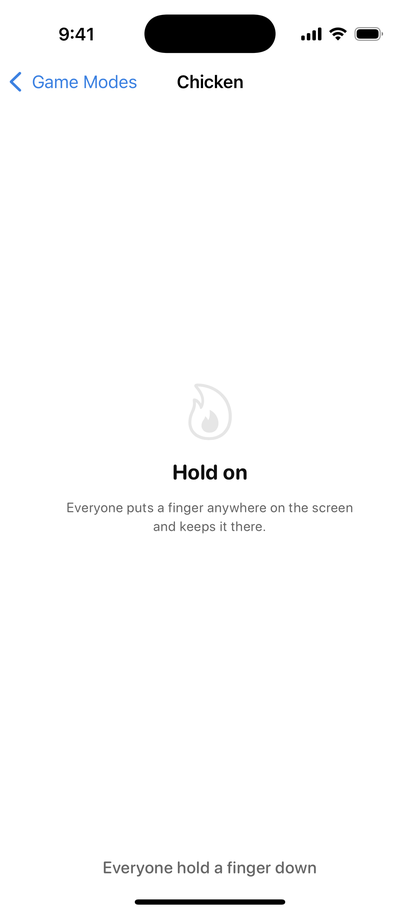

<div align="center">


# Caster

**Six ways to let a phone decide.**

Pass-the-phone party games for settling who goes first, who buys the next round,
and who is doing the washing up. One device, everybody's fingers on the glass,
no accounts and no network.

[](https://github.com/Djxsper/caster/actions/workflows/ios-simulator.yml)
[](LICENSE)
[](#install-on-iphone-or-ipad)
[](#android)






</div>

---

## The games

| | Mode | How it goes |
|---|---|---|
| 👆 | **Finger Picker** | Everyone holds a finger down. After three still seconds the app picks somebody — or splits the table into teams, or puts everyone in an order. |
| 🎡 | **Pinwheel** | Spin a wheel of names, chores, or anything else you type in. Unlimited entries, and wheels are saved and named so you can keep several. |
| ⏲️ | **Hot Potato** | A hidden fuse burns while the phone goes round. Tap to pass. Whoever is holding it when it blows loses. |
| ⚡ | **Uppercut** | Hold a finger. When the light flips and the tone hits, lift. Fastest wins, slowest loses, and going early ends it on the spot. Calls people by name when a roster is saved. |
| 🔨 | **Tap Frenzy** | Claim a circle and hammer it for five seconds to lean the draw your way — towards you or away from you, your choice. |
| 🔥 | **Chicken** | Circles light up one at a time. Let go in time and you are out safe. The window starts at 100 ms and eases until somebody can beat it. Last one still holding loses. |

<div align="center">




</div>

---

## Install on iPhone or iPad

**Requirements:** iOS 17.0 or newer. Works on iPhone and iPad.

Caster is not on the App Store, so there are two ways in. Sideloading is easier;
building from source is free forever and needs a Mac.

### Option A — Sideload the IPA (no Mac needed)

The build published here is **unsigned**, which means you re-sign it with your own
free Apple ID at install time. [AltStore](https://altstore.io) and
[SideStore](https://sidestore.io) both do this for you.

1. Install **AltStore** (needs a PC or Mac running AltServer once) or **SideStore**
   (on-device, no computer after setup). Follow their own setup guide first —
   it is the fiddly part, and it is a one-time thing.
2. On your iPhone, open [**Releases**](https://github.com/Djxsper/caster/releases)
   and download `Caster-<version>.ipa`.
3. Open the downloaded file and **Share → AltStore** (or SideStore). It will ask
   for your Apple ID so it can sign the app with it.
4. Wait for it to finish, then launch Caster from your home screen.

> **Free Apple ID limits.** Apple gives free accounts a 7-day signing certificate
> and a cap of three sideloaded apps. After a week the app stops opening until you
> refresh it — AltStore/SideStore can do that automatically over Wi-Fi. A paid
> Apple Developer account ($99/yr) stretches this to a year.

### Option B — Build it yourself (free, needs a Mac)

1. Install **Xcode 16 or newer** from the Mac App Store. (The project uses
   file-system synchronised groups, which older Xcode cannot open.)
2. Clone and open it:
   ```sh
   git clone https://github.com/Djxsper/caster.git
   cd caster
   open Caster.xcodeproj
   ```
3. Plug in your iPhone and pick it as the run destination.
4. Select the **Caster** target → **Signing & Capabilities** → tick *Automatically
   manage signing* and choose your own Apple ID team. Change the bundle identifier
   from `com.jesperhaafkes.Caster` to something of your own, e.g. `com.yourname.Caster`.
5. Press **Run**. On first launch the iPhone will refuse to open it until you
   trust the certificate: **Settings → General → VPN & Device Management → your
   Apple ID → Trust**.

---

## Android

There is an Android version, in [`android/`](android). It is a second native app
— Kotlin with Jetpack Compose — not a wrapper or a port of the binary, and it is
not on Google Play yet.

The two apps share no code, and that is not laziness. Caster's interface is
SwiftUI, its multi-touch layer is UIKit, its buzzes are Core Haptics and its tones
are AVFoundation; none of those exist on Android. Tools that promise one codebase
break on exactly this app. [Skip](https://skip.dev) maps SwiftUI to Compose but
not UIKit views, and does not cover Core Haptics or AVAudioEngine. The official
[Swift SDK for Android](https://www.swift.org/blog/exploring-the-swift-sdk-for-android/)
(Swift 6.3) compiles Swift libraries, but SwiftUI does not run there. So the game
rules were written twice, deliberately, and the two `Domain` layers are kept in
step by hand.

Build it with Android Studio, or:

```sh
cd android
./gradlew test          # unit tests, including the touch-slot suite
./gradlew assembleDebug # APK in app/build/outputs/apk/debug/
```

Requires **Android 8.0 (API 26)** or newer.

As with iOS, an emulator can only prove it compiles. Synthetic events give you one
finger, so the slot tracking, reaction timing and haptics are only ever verified
on a real device — which is what [`TouchArenaTest`](android/app/src/test/java/com/jesperhaafkes/caster/TouchArenaTest.kt)
exists to compensate for.

---

## Building and hacking on it

No package manager, no dependencies, no generated files — clone and open.

```
Caster/
├── App/            Entry point, shared services, CI deep-link support
├── Domain/         Game modes, saved rosters and wheels, the weighted draw
├── Interface/
│   ├── Audio/      Cue tones, synthesised at launch (no audio assets ship)
│   ├── Components/ Buttons, finger rings, the shared touch surface
│   ├── Haptics/    Core Haptics with a UIKit fallback
│   ├── Themes/     Light and dark palettes
│   └── Views/      Launch, setup and one screen per game
└── UIKitBridge/    True multi-touch, and the slot tracking built on it
```

A few things worth knowing before you change something:

- **`TouchArena` is where the multi-touch lives.** SwiftUI's own gestures report
  one finger, which is useless here, so touches come through a `UIView`. Each
  finger is mapped to a *slot* — either sequentially (Finger Picker frees a colour
  the moment a finger lifts) or *stickily* (the reaction games let a finger lift
  and land again without stealing a neighbour's seat).
- **Reaction times come from `UITouch.timestamp`,** never from a `Date()` read
  inside a callback. Chicken's window opens at 100 ms; measuring that in a
  callback would be measuring the main thread, not the player.
- **Draws are decided before the animation.** Pinwheel picks its winner uniformly
  and *then* aims the spin at it — letting friction decide would quietly bias the
  result toward wherever the wheel was resting. Tap Frenzy does the same behind
  its spotlight sweep.
- **Tapping never buys certainty.** In Tap Frenzy everybody keeps a floor in the
  draw whatever they do, so the gap between the hardest tapper and the laziest is
  capped at five to one, in either direction.
- **Nothing anybody typed lives in a view.** Names go to `RosterStore` and wheel
  entries to `WheelStore`, both written to `UserDefaults` on every keystroke and
  both keeping several named sets side by side. A list held in a screen's
  `@State` is a list that a back-swipe throws away — which is exactly what used
  to happen to twelve hand-typed names.

### CI

Every push builds on a macOS runner, boots a simulator, screenshots every screen
and packages an unsigned IPA — see
[`.github/workflows/ios-simulator.yml`](.github/workflows/ios-simulator.yml).
Artifacts land on the run page.

Pushing a `v*` tag additionally publishes a GitHub Release with the IPA attached
([`release.yml`](.github/workflows/release.yml)):

```sh
git tag v1.0.0
git push origin v1.0.0
```

Note that CI can only prove the app *compiles* and that each screen renders. The
simulator has no real multi-touch, so the finger tracking, reaction timing and
audio are only ever verified on a device.

---

## License

[MIT](LICENSE) — do what you like with it, just keep the copyright notice.
